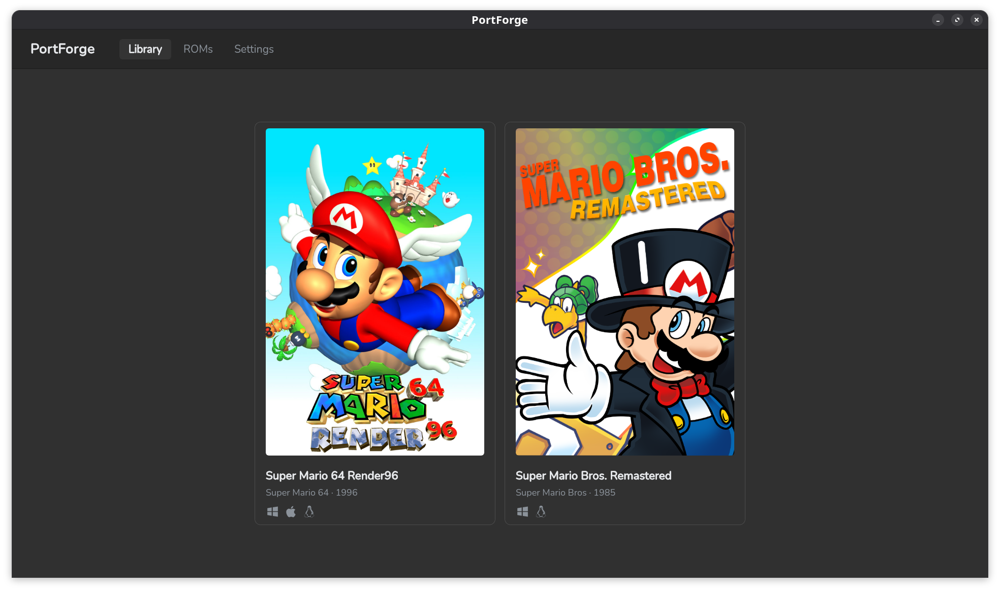

# PortForge

A desktop application for managing and launching game ports. PortForge handles downloading, building, and installing ports — including those that require compilation from source — and keeps your ROM library organized so games that depend on original ROM files can find them automatically.

Built with [Wails v2](https://wails.io) (Go backend, Vue 3 frontend).

<p align="center" style="text-align: center">
  
</p>

---

## ALPHA NOTICE!

This program is still at a very early stage. There are going to be bugs, I honestly have no idea to what degree it will work on Windows or Mac, and while I will try to avoid it, future updates may require manual moving of user data files.

---

## On MediaItems

`MediaItem` is a filesystem-native open standard for cataloguing, archiving, and interacting with any form of media of my own invention. Documentation covering the standard will be released "soon™".

---

## Roadmap

- Add support for per-game executable arguments
- Add support for editing per-game executable arguments from the PortForge UI
- Add support for managing different versions of games
- Add support for managing mods without reinstalling
- Add support for building games for mobile platforms like Android and Nintendo Switch
- Expand documentation to include how to dump ROMs
- Symlink ROM files instead of copying them (won't work on Windows)
- Expand ROM management functionality
- Build complete ROM database based on No-Intro and Redump
- Add support for playing Rom files via emulators
- Add support for getting older PC games to run

---

## Features

- **Library view** — browse available game ports with cover art and banner images
- **One-click install** — download, extract, build, and launch from a single button
- **Build system** — supports ports that must be compiled from source (e.g. SM64 ports), with per-platform build specs, multi-variant installs, and user-configurable args
- **ROM management** — import ROMs by drag-and-drop; PortForge matches files by checksum and stores them in a central library
- **Install variants** — choose ROM region, texture pack, or other options before installing; options requiring a missing ROM are shown as unavailable
- **Play time tracking** — session length is recorded and added to a time counter
- **Uninstall** — remove installed files via the UI, with optional custom uninstall steps per game
- **Cross-platform** — Windows, macOS, and Linux

---

## Requirements

### Running PortForge

- Windows 10+, macOS 12+, or a modern Linux desktop

### Building from source

- [Go 1.23+](https://go.dev)
- [Node.js 18+](https://nodejs.org)
- [Wails CLI v2](https://wails.io/docs/gettingstarted/installation): `go install github.com/wailsapp/wails/v2/cmd/wails@latest`

---

## Getting started

### Development

```bash
wails dev
```

Starts a Vite dev server with hot reload for the frontend. The app is also accessible in a browser at `http://localhost:34115`.

### Production build

```bash
wails build
```

Produces a self-contained binary in `build/bin/`.

---

## First-run setup

On first launch PortForge asks for two folders:

| Folder                 | Purpose                                                                                              |
| ---------------------- | ---------------------------------------------------------------------------------------------------- |
| **MediaItems library** | Read-only. Contains game metadata (`.mediaitem.json`), install specs (`.install.json`), and artwork. |
| **User data folder**   | Writable. PortForge stores your ROM files, installed games, and save state here.                     |

These can be changed at any time in Settings.

---

## MediaItems library

The library is a folder tree of _MediaItems_ — JSON files that describe games, ROMs, and platforms. PortForge reads this folder at startup; it never writes to it.

```
mediaitems/
├── VideoGameVersion/
│   └── Super Mario 64 Render96 · 2020/
│       ├── .mediaitem.json     ← game metadata, download URL, ROM dependencies
│       ├── .install.json       ← build spec (optional)
│       └── .artwork/
│           ├── cover.jpg
│           └── banner.jpg
└── VideoGameRom/
    └── Super Mario 64 (USA)/
        └── .mediaitem.json     ← ROM title, platform, expected checksums
```

---

## ROM library

ROMs are stored in the user data folder and identified by MD5 checksum rather than filename. To add ROMs, drag and drop the files onto any PortForge window. PortForge matches each file against the known ROMs in the library and offers to copy or move it into place.

---

## Build system

All games come with a `.install.json` file alongside their `.mediaitem.json`. The spec defines dependencies, user-configurable args, and an ordered list of install steps.

See **[docs/build-system.md](docs/build-system.md)** for the full reference, including all step types (`fetch`, `extract`, `run`, `copy`, `move`, `defineExecutable`, and more), arg configuration, conditional steps, and a complete worked example.

### Quick example

```json
[
  {
    "targetPlatforms": ["Linux"],
    "dependencies": ["make", "gcc", "python3"],
    "args": {
      "romVersion": {
        "type": "choice",
        "label": "ROM region",
        "options": [
          { "value": "us", "label": "US (NTSC)", "romTitle": "Super Mario 64 (USA)" },
          { "value": "eu", "label": "European (PAL)", "romTitle": "Super Mario 64 (Europe) (En,Fr,De)" }
        ]
      }
    },
    "steps": [
      { "step": "fetch", "url": "https://example.com/source.zip", "dest": ".build/source.zip" },
      { "step": "extract", "src": ".build/source.zip", "dest": ".build/" },
      { "step": "copy", "from": "rom", "arg": "romVersion", "dest": ".build/source/baserom.${romVersion}.z64" },
      { "step": "run", "cmd": "make", "args": ["VERSION=${romVersion}"] },
      { "step": "move", "src": ".build/source/build/${romVersion}_pc", "dest": "install" },
      { "step": "defineExecutable", "executable": "install/sm64.${romVersion}.f3dex2e" }
    ]
  }
]
```

---

## Project structure

```
portforge/
├── app.go              ← backend: install, launch, ROM management, settings
├── main.go             ← Wails entry point
├── launch_unix.go      ← platform-specific launch logic
├── launch_windows.go
├── models/
│   └── models.go       ← shared data types (VideoGameVersion, InstallState, etc.)
├── metadata/
│   └── loader.go       ← reads the MediaItems library and user state files
├── frontend/
│   └── src/
│       ├── App.vue           ← shell, navigation, global install state
│       └── components/
│           ├── GameLibrary.vue
│           ├── GameDetail.vue
│           ├── RomLibrary.vue
│           └── Settings.vue
├── docs/
│   └── build-system.md ← full build spec reference
└── wails.json
```

---

## Credits

- The developers and contributors of the various game ports
- [The Wails project](https://wails.io/) and its contributors
- [No-Intro](https://no-intro.org/) and [Redump](http://redump.org/) for cataloging original game media
- The contributors to [SteamGridDB](https://www.steamgriddb.com/) for game artwork
- Claude by Anthropic for coding assistance
- The entire Open Source ecosystem and the community behind it

---

## License

- The source code is released under the GPL-3.0 license
- All game specific artwork belongs to the respective rights holders
